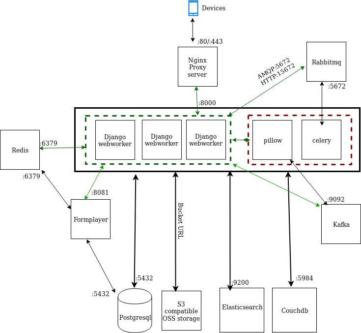

# CommcareHQ 
### What is the Phone responsible for
-   Processing CommCare XML (XForms Spec)
-   Playing the forms specified by the XML
-   Sending the processed XML back to the server
### What is website responsible for 
-   Building the XML to be played on the forms
-   Analyzing and viewing the data from the submissions
-   Other meta things like user management
### Life of a Form submission
-   In web worker process
-   Received as XML document
-   Parsed for form metadata and case updates
-   Form metadata and case changes are saved to primary DB (postgres models)
-   Form metadata is a structured model
-   Case metadata is a structured model, and case properties are stored as a JSON column
-   Form XML is saved to RiakCS
-   Record of form/case update event is pushed to Kafka where it is picked up by asynchronous processors (pillows)
-   Asynchronous processors pick up events from Kafka handle ETL into ElasticSearch, Postgres report tables, and any other events.


In this doc you'll see an Basic overview of different Component interaction and what their purpose is in commcareHQ.

<sub><sup>Notes:- Application ports  mentioned in the Architecture is configurable. The servers mentioned inside the box is just for  simplify the illustration.For example a thick black box and a thick Black arrow pointing to postgresql means all the services inside the thick Black box will be connecting to postgresql. </sup></sub>
<hr style="border-top: dotted 1px;" />

##### A Basic Architecture will look like this.
  
  


<hr style="border-top: dotted 1px;" />


  ##### A Brief overview of the systems involved in above and their role in supporting the commcarehq.
  ##### Key Services
  Database
  * Postgresql
  * CouchDB
  * Elasticsearch
  * Redis
  * S3 Compatible OSS object storage
  
Commcare Processes
  * Django
  * Celery
  * Pillows
  * Formplayer
  
  Othes
  * Nginx(Proxy)
  * RabbitMQ
  * Shared Directory
  

<hr style="border-top: dotted 1px;" />

**Nginx:-** Entry point for the stack involved in the commcarehq , This will act as a load balancer/reverse proxy and forward the user request to the webworkers.
 
 
 
 ```
 upstream commcarehq {
    least_conn;
    server 192.168.33.16:8000;
    server 192.168.33.17:8000;
    server 192.168.33.18:8000;
}
server {
    listen 80;
    server_name localhost;
    root /var/www/html;
    location /static/ {
        alias /home/cchq/src/cchq/staticfiles/;
    }
    location / {
        proxy_pass http://commcarehq;
    }
}
 ```
**Django Webworker:-** This is where the python code runs and interact with different subsystem depending on the user requests. It handles almost all the logic of commcarehq
 
**Pillow:-** it Takes changes to primary data(couchdDB) and updates secondary data sources(Postgresql,Elasticsearch).Pillow detects changes in couchdb with change_feed feature available in couchdb. it pushes the changes in kafka topics, from there some other pilow service read the changes and applies necessaries changes to postgresql or elasticsearch.

**Celery:**- This machines runs the celery process. [Celery](http://www.celeryproject.org/) consumes from rabbitmq queue and process them. Anything which usually takes time like sending an email/sms would be run through celery systems.

Notes:-
Django Webworker,Celery and Pillowtop has same codebase [commcarehq](https://github.com/dimagi/commcare-hq/). They just run different piece of code depending on which server they are running on.The Confiuration file for these and usage is [here](https://github.com/dimagi/commcare-hq/blob/master/localsettings.example.py) and [here](https://github.com/dimagi/commcare-hq/blob/master/settings.py) .

**Redis:-** Used for caching the frequent needed information to reduce round-trips and increase the response time. It is also used for locking and User sessions.
 


**Formplayer:-** Formplayer is a Java service that allows us to use applications on the web instead of on a 
mobile device. Formplayer cache session instance in redis , stores session instances via Postgres and builds SQLite database for each restored user. For more information on building and running it see it [here](https://github.com/dimagi/formplayer) and for sample configuration see it [here](https://github.com/dimagi/formplayer/blob/master/config/application.example.properties).

 


**RabbitMQ :**- it runs RabbitMQ which is an open source message broker software. It accepts messages from producers, and delivers them to consumers. It acts like a middleman which can be used to reduce loads and delivery times taken by web application servers.

 

**Postgresql :-** This is the Primary Database for commcarehq . All the forms,user,application etc info are stored in this DB. You can have different dbs for report,sync,warehouse stuff either in the same machine or in the different machines. you just have to provide the connection info in settings of django webworker.
- what does it store
   - Form Data
   - Case Data
   - Locations
   - Accounting
   - Also used for some reporting
   - UCRs

**CouchDB:-**  It's running couchdb which is a no sql databse and also our legacy Primary datasource. Mostly it contains user related info.

**Kafka :-** Kafka is a distributed streaming platform that is used for  publish and subscribe to streams of records. kafka  replicates topic log partitions to multiple servers. Any Changes that happens on couchdb is feed to kafka topics systems from there it's consumed by the pillowtop servers.

 

**Elasticsearch:-** It's our secondary analytics data. It's great for searching and querying. It's used for reports,Users,forms etc.forms, cases, users, domains, groups, ledgers, sms logs are stored in ES.

- Places where we use Elasticsearch
    - Standard reports
    - The “groups or users” filter
    - Case search
    - User list pages (and the search functionality)
    - Backend for APIs
    - Backend for data exports
    - Admin reports

- Getting data into ES
   - Pillows trigger on doc save via couch changes feed and/or kafka
   - Users are (also) added directly on save
   - Records are sent to a particular index
   - There is often a transformation that happens in the pillow
   - Index mappings tell ES how to store documents appropriately for queries


**S3 Compatible OSS Storage :-** It's Key value store of binary data and used for saving forms. it's massive scalable. The forms submitted through user is saved here and then process by Django Webworkers. if you don't have such storage then you can use a file system folders as well

**Shared Directory:-**  it's a Network File System which is shared across Django Webworkers . it's Mostly useful for Caching a file (User reports Exports etc..)and lookup for File.

